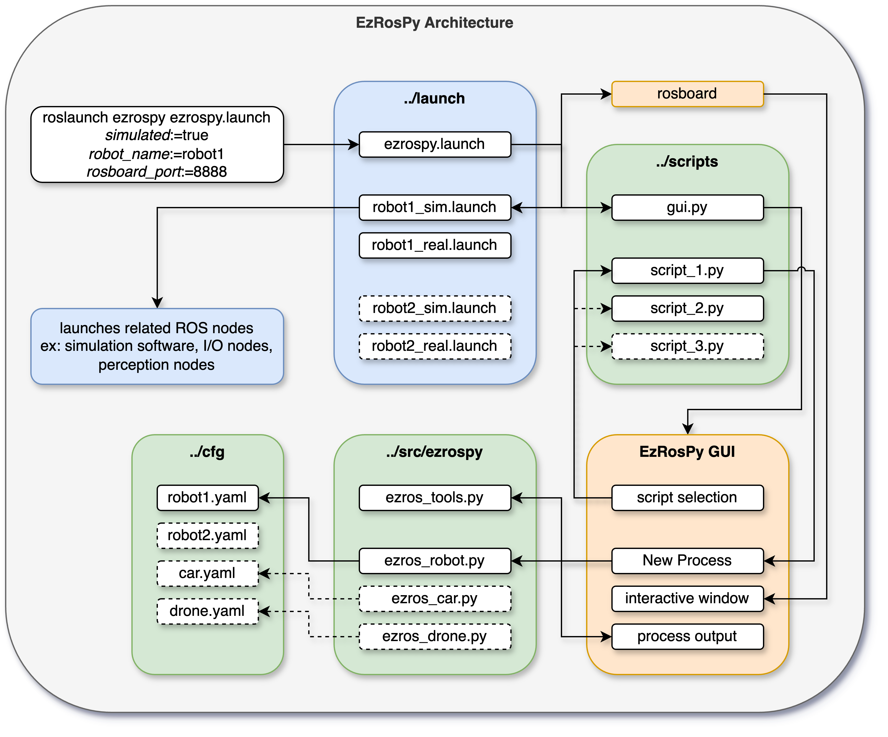

# EzRosPy

This ROS package simplifies writing scripted behaviors for ROS Noetic based robots, particularly useful when you want to trigger or automate a set of sequential but still dynamic and repeatable behaviors. It is meant to simplify the setup process for simulation and real life testing.

The inspiration behind this package was replicating an Autonomous car's behaviour in simulation as well as in real life testing for predetermined scenarios in controlled environments. This allows for ease of testing and comparison when developing new software or trying out different hardware, for example regression testing between different Lidar scanners or CV based obstacle avoidance algorithms.

The overarching goal of this package is to simplify ROS interfaces for short-term developers who may not need to build a full ROS stack or learn ROS in-depth but still need to use a ROS based robotic system for research or educational purposes. New developers or student teams using this package in conjunction with the ROS basics tutorials can speed up their development process for smaller projects.

## Installation

Prerequisites:

- Python 3.8 or higher
- ROS Noetic installed
- ROS workspace created with `catkin build`

```bash
# Open terminal inside the ../src/ folder of your ROS workspace and clone the ezrospy repository
git clone https://github.com/Aeolus96/ezrospy.git

# Move into the ezrospy folder
cd ezrospy

# Run this script to install dependencies
sudo chmod +x install.sh
./install.sh
```

## Usage

To use this software, understanding this package's architecture and completing at least the ROS Noetic basics tutorials is important.

Here's the architecture diagram:



```bash
# Example launch command
roslaunch ezrospy ezrospy.launch simulated:=true robot_name:=robot1 rosboard_port:=8888
```

### Launch

Arguments for simulated or real robot, and robot name dynamically link to their respective launch files in the `launch` folder. When making new configurations, consistent naming and separation of launch files is important.

The launch file will load the correct launch file based on the robot name. Currently only two environments are supported: simulated and real.

### GUI

The terminal will print out the link to the EzRosPy GUI and ROSboard. You can CTRL+click to open them in the default web browser. The default is `localhost:8080` and `localhost:8888` respectively.

ROSboard is made available in the GUI for ease of use with mobile displays while testing. Together with the script's output, this significantly reduces the debug time by displaying cause and effect in real time.

### Custom Scripts

Once GUI is open, you can use the script dropdown menu select, run and stop custom scripts. The script output will be shown in the terminal as well as in the GUI. To add new scripts, you can make a new `.py` file in the `/scripts` directory and then press the reload button in the GUI to refresh the dropdown menu.

Inside the script, you can currently only run a single robot (ROS API limitation). To specify robot's namespace, subscribers and publishers, use the `.yaml` file in the `/cfg` directory.

>Open one of the example scripts to see how they work. Dive deeper into the method calls to learn more ways to use them dynamically.

### Adding Custom Features/Robot Classes

Using the EzRobot as a superclass, you can create your own custom robot class that inherits from `ezros_robot.py`. Then add your own custom methods to drive, detect, navigate, stop, etc...

## Contributing

Contributions are welcome! If you find any issues or have suggestions for improvements, please open an issue or submit a pull request on GitHub.

## License

This software is released under the [MIT License](LICENSE).
